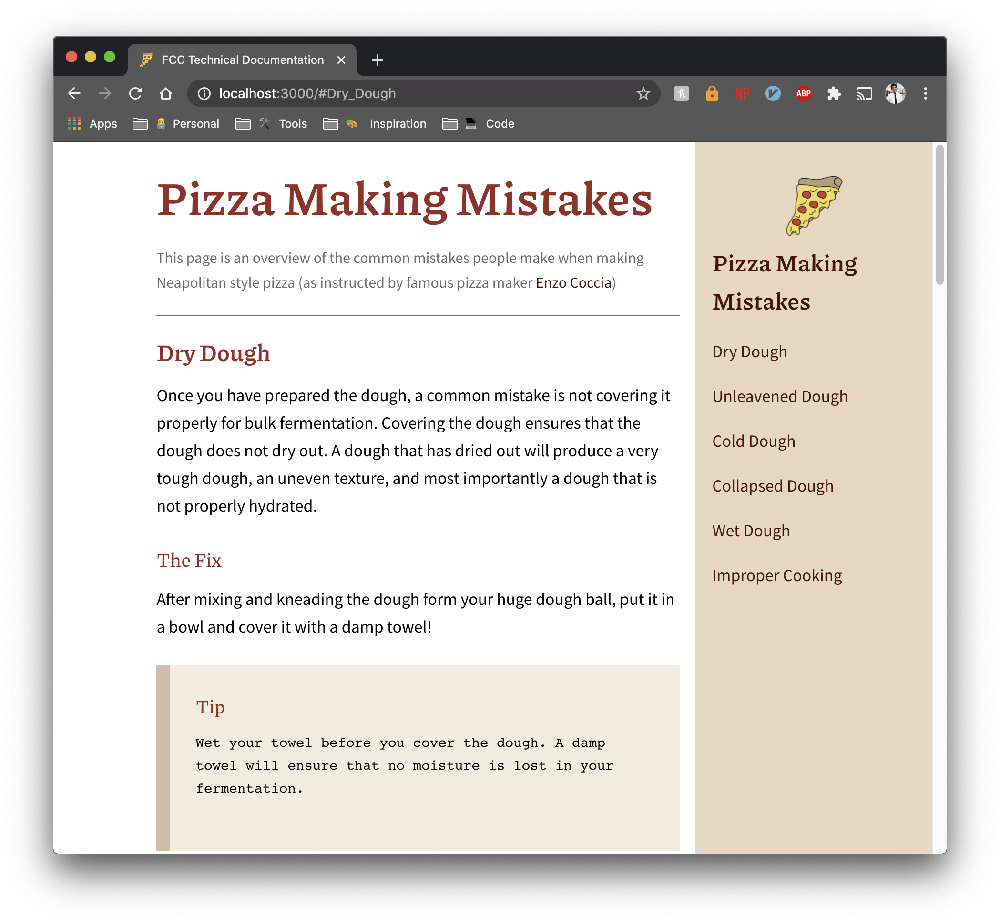

# My [FreeCodeCamp](https://www.freecodecamp.org/pineapplegiant) Technical Documentation Page 🍕!
[Neovim is the hero](https://img.shields.io/badge/made%20with-neovim%E2%9D%A4%EF%B8%8F-blue)

Here's my pizza design that I made using flexbox and lots of love.

    

## Style Guide

    

## Tools
* Pizza Info? - [pizza info](https://www.youtube.com/watch?v=vV4gegZ7JNU)
* Editor - [Neovim](https://neovim.io/)
* Design - [Adobe XD](https://www.adobe.com/products/xd.html)
* Layout - [Flexbox](https://css-tricks.com/snippets/css/a-guide-to-flexbox/)
* Typography:
    - [Piazzolo](https://fonts.google.com/specimen/Piazzolla?query=piazz)
    - [Open Sans Pro](https://fonts.google.com/specimen/Open+Sans?query=open+sans)
